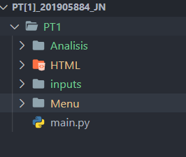
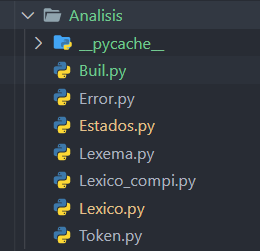
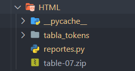

<link href='media/css/style.css' rel='stylesheet' type='text/css'></link>

# Manual Técnico


<br>
<br>

Santiago Julián Barrera Reyes<br>
201905884<br>
Sección N<br>
Catedrático<br>
Ing. Kevin Adiel Lajpop Ajpacajá<br>
Tutor académico<br>
Pablo Fernando Cabrera Pineda<br>
“Id y enseñad a todos”<br>
<br>
<br>

## Índice   
1. [Introducción](#id1)
2. [Objetivos](#id2)
3. [Requerimientos](#id3)
4. [Instalación y Configuración](#id4)
5. [Diagrama Entidad Relación](#id5)
6. [Automás Generados](#id6)
7. [Configuración del Sistema](#id7)
   1. [Estructura Raíz](#id7.1)
   2. [Directorio Analisis](#id7.2)
   3. [Directorio HTML](#id7.3)

<br>
<br>

## Introducción<a name="id1"></a>
Este manual describe los pasos necesarios para que cualquier estudiante con bases en la programación, desarrollo de autómatas y gramaticas regulares pueda realizar la correcta ejecución del software creado.

Es importante tener en cuenta que el presente manual hace mención a las especificaciones sobre cómo desarrollar una gramática regular y el proceso que se realizó para crearla.

<br>

## Objetivos<a name="id2"></a>
Brindar la información necesaria para poder realizar la instalación y configuración del software presentado. Además de su integración al análisis léxico y sintáctico.

- Desarrollar una solución de software implementando un analizador léxico mediante autómatas.
- Desarrollar una solución de software implementando un analizador sintáctico mediante gramatica.
- Aplique los conocimientos adquiridos en el laboratorio, del lenguaje de programación Python.

<br>

## Requerimientos<a name="id3"></a>
REQUERIMIENTOS MÍNIMOS DE HARDWARE

- Procesador: Core
- Memoria RAM: Mínimo: 2 Gigabytes (GB)
- Disco Duro: 32Gb.

REQUERIMIENTOS MÍNIMOS DE SOFTWARE

- Privilegios de administrador
- Sistema Operativo: Windows 8 o 10 o 11
- Python: 3.10.3

<br>

## Instalación y Configuración<a name="id4"></a>
Ingresa a la carpeta donde se encuentra el programa descargado, abre una terminal con la ruta de la carpeta e inicializa el main.py en la terminal genera.

Otra manera es teniendo instalado el ID visual estudio puede abrirlo con esta herramienta y correr el archivo main.py desde el mismo para su ejecución.

<br>

## Diagrama Entidad Relación<a name="id5"></a>
A continuación, se muestra el diagrama relacional de las tablas que componen el sistema:


<br>
<br>

## Tokens Generados<a name="id8"></a>
A continuación, se muestra la Tabla de tokens:


| Token             | Descripción                         | Patrón                                                  |
| ----------------- | ----------------------------------- | ------------------------------------------------------- |
| comment_line      | Comentario de una Linea             | //.\*                                                   |
| comment_multiLine | Comentario multilinea Linea         | (\/\*([[^\*]\n])\*\*\/ )                                |
| tipo_int          | Tipo de dato int                    | int                                                     |
| tipo_double       | Tipo de dato double                 | double                                                  |
| tipo_string       | Tipo de dato string                 | string                                                  |
| tipo_char         | Tipo de dato char                   | char                                                    |
| tipo_boolean      | Tipo de dato boolean                | boolena                                                 |
| tipo              | Tipo de dato                        | tipo_int/tipo_double/tipo_string/tipo_char/tipo_boolean |
| identificador     | Simbolo nombre entidad              | ^([a-zA-Z_])([\w]*)                                     |
| operator_Ar       | Operador aritmetico suma            | +                                                       |
| operator_Ar       | Operador aritmetico resta           | -                                                       |
| operator_Ar       | Operador aritmetico multiplicacion  | \*                                                      |
| operator_Ar       | Operador aritmetico division        | /                                                       |
| operator_Ar       | Operador aritmetico resto           | %                                                       |
| operator_As       | Operador de asignación              | =                                                       |
| operator_Rs       | Operador de relacion Igualacion     | ==                                                      |
| operator_Rs       | Operador de relacion Diferenciacion | !=                                                      |
| operator_Rs       | Operador de relacion Mayor          | >                                                       |
| operator_Rs       | Operador de relacion Mayor igual    | >=                                                      |
| operator_Rs       | Operador de relacion Menor          | <                                                       |
| operator_Rs       | Operador de relacion Menor igual    | <=                                                      |
| operator_Ls       | Operador logico and                 | &&                                                      |
| operator_Ls       | Operador logico or                  | ||                                                      |
| operator_Ls       | Operador logico not                 | !                                                       |
| dato_int          | Tipo de dato int                    | [+-]?([0-9]+)                                           |
| dato_double       | Tipo de dato double                 | [+-]?([0-9]*[.])?[0-9]+                                 |
| dato_string       | Tipo de dato string                 | "([[^"](\")])*"                                         |
| dato_char         | Tipo de dato char                   | '([[^'](\')])'                                          |
| dato_boolean      | Tipo de dato boolean                | ^(false|true)                                           |
| dato              | Dato de cualquier tipo              | dato_int/dato_double/dato_string/dato_char/dato_boolean |
| conditional_if    | Estructura condicional if           | if                                                      |
| conditional_else  | Estructura condicional else         | else                                                    |
| iterative_do      | Estructura iterativa do             | do                                                      |
| iterative_while   | Estructura iterativa while          | while                                                   |
| parA              | Paréntesis abierto                  | (                                                       |
| parB              | Paréntesis cerrado                  | )                                                       |
| punto_coma        | Punto y coma                        | ;                                                       |
| llaveA            | Llave abierta                       | {                                                       |
| llaveB            | Llave cerrada                       | }                                                       |
| metodo_void       | Metodo void                         | void                                                    |
| coma              | Operador coma                       |  ,                                                      |
| metodo_run        | Retorna un valor                    |  return                                                 |
| corA              | Corchete abierto                    | [                                                       |
| corB              | Corchete cerrado                    | ]                                                       |
| punto             | Operador punto                      | .                                                       |


<br>
<br>

## Automás Generados<a name="id6"></a>
A continuación, se muestran los automás  elaborados en el proyecto por medio del metodo del arbol:


<br>
<br>

## Sub Índice
- [Manual Técnico](#manual-técnico)
  - [Índice](#índice)
  - [Introducción<a name="id1"></a>](#introducción)
  - [Objetivos<a name="id2"></a>](#objetivos)
  - [Requerimientos<a name="id3"></a>](#requerimientos)
  - [Instalación y Configuración<a name="id4"></a>](#instalación-y-configuración)
  - [Diagrama Entidad Relación<a name="id5"></a>](#diagrama-entidad-relación)
  - [Tokens Generados<a name="id8"></a>](#tokens-generados)
  - [Automás Generados<a name="id6"></a>](#automás-generados)
  - [Sub Índice](#sub-índice)
- [1. Gramática de Simple C o SC](#1-gramática-de-simple-c-o-sc)
  - [1.1. Alfabeto](#11-alfabeto)
    - [1.1.1. Símbolos terminales](#111-símbolos-terminales)
      - [1.1.1.1. Expresiones regulares](#1111-expresiones-regulares)
      - [1.1.1.2. Palabras reservadas](#1112-palabras-reservadas)
    - [1.1.2. Símbolos no terminales](#112-símbolos-no-terminales)
    - [1.2.1. Precedencia](#121-precedencia)
    - [1.2.2. Producciones](#122-producciones)
  - [Configuración del Sistema<a name="id7"></a>](#configuración-del-sistema)
    - [Estructura Raíz<a name="id7.1"></a>](#estructura-raíz)
    - [Directorio Analisis <a name="id7.2"></a>](#directorio-analisis-)
    - [Directorio HTML <a name="id7.3"></a>](#directorio-html-)

# 1. Gramática de Simple C o SC

## 1.1. Alfabeto
### 1.1.1. Símbolos terminales
#### 1.1.1.1. Expresiones regulares

T = {empty,METHOD_VOID,ID,LPAREN,RPAREN,LKEY,RKEY,TYPE_INT,TYPE_DOUBLE,TYPE_STRING,TYPE_CHAR,TYPE_BOOL,COMENTLINE,COMENTMULTYLINE,BREAK,DOT_AN_DCOMMA,CONTINUE,METHOD_RETURN,CONDITIONAL_IF,CONDITIONAL_ELSE,ITERATIVE_WHILE,ITERATIVE_DO,AND,OR,NOT,IQUALS,DIFFERENT,IQUAL_GREATER,IQUAL_LESS,GREATER,LESS,PLUS,MINUS,DIVIDE,REST,INT,FLOAT,STRING,CHAR,DATA_BOOL,COMMA}

| Token                   |         Patrón         |
| ----------------------- | :--------------------: |
| COMENTMULTYLINE         | (/\*(.|\n)*?\*/)|(//.*) |
| COMENTLINE              |    \/\/(.*)            |
| ID |           [a-zA-Z_][a-zA-Z_0-9]*            |
| PLUS       |           +            |
| AND       |           &&           |
| OR          |           II            |
| NOT                  |          !           |
| MINUS                      | - |
| TIMES                      | * |
| DIVIDE                      | / |
| REST                      | % |
| GREATER                      | > |
| LESS                      | < |
| IQUAL_GREATER                      | >= |
| IQUAL_LESS                      | <= |
| IQUALS                      | == |
| DIFFERENT                      | != |
| IQUAL                      | = |
| STRING                      | \"([^\\\n]|(\\.))*?\" |
| CHAR                      | \'([^\\\n]|(\\.))?\' |
| DATA_BOOL                      | true|false |
| FLOAT                      | \d+\.\d+ |
| INT                      | \d+ |
| LPAREN                      | ( |
| RPAREN                      | ) |
| LKEY                      | { |
| RKEY                      | } |
| DOT_AN_DCOMMA                      | ; |
| COMMA                      | , |

#### 1.1.1.2. Palabras reservadas

| Token            | Patrón |
| ---------------- | ------ |
| METHOD_VOID | void |
| METHOD_RETURN | return |
| BREAK | break |
| CONTINUE | continue |
| TYPE_INT | int |
| TYPE_DOUBLE | double |
| TYPE_STRING | string |
| TYPE_CHAR | char |
| TYPE_BOOL | boolean |
| CONDITIONAL_IF | if |
| CONDITIONAL_ELSE | else |
| ITERATIVE_WHILE | while |
| ITERATIVE_DO | boolean |
| TYPE_BOOL | do |


### 1.1.2. Símbolos no terminales

N = {INITIAL,L_INST,INTS,METHODS,FUNTIONS,SENTENCES,METHOD,SENTENCES_METHOD,L_PARAMS,FUNTIONS,FUNTION,COUPLER,SENTENCES_FUNTION,SENTENCES_METHOD,SENTENCE_METHOD,DECLARATIONS,ASSIGNMENTS,SENTENCES_IF,SENTENCES_WHILE,CALLS,SENTENCE_FUNTION,SENTENCE,SENTENCE_IF,INSTRUCTIONS,SENTENCE_WHILE,OPTIONS,OPTION,EXPRESSIONS,E,TYPE_DATO,DECLARATION,ASSIGNMENT,PARAM,CALL}

| Token       | Descripción                                       |
| ----------- | ------------------------------------------------- |
| INITIAL        | Estado inicial de la sintáxis                     |
| L_INST | Lista Instrucciones |
| INTS           |  Instrucción                               |
| METHODS           |  Lista Metodos                               |
| METHOD           |  Estrucutura del metodo                               |
| FUNTIONS           |  Lista Funciones                               |
| FUNTION           |  Acople Funcióm                               |
| COUPLER           |  Estructura Función                               |
| SENTENCES_METHOD           |  Metodo                               |
| SENTENCE_METHOD           |  Contenido Metodo                               |
| SENTENCES_FUNTION           |  Función                               |
| SENTENCE_FUNTION           |  Contenido Función                               |
| SENTENCES           |  Contenido Block                               |
| SENTENCE           |  Block                               |
| SENTENCES_IF           |  Lista Sentencia if                               |
| Estructura if           |  SENTENCE_IF                               |
| SENTENCES_WHILE           |   Lista Sentencia while |
| SENTENCE_WHILE           |  Estructura while                               |
| INSTRUCTIONS           |  Operaciones                               |
| OPTIONS           |  Opción                               |
| OPTION           |  Estructura Opción                               |
| EXPRESSIONS           |  Lista Opciones Aritmeticas                               |
| E           |  Opción Aritmetica                               |
| DECLARATIONS           |  Lista Declaraciones                               |
| DECLARATION           |  Declaracion                               |
| ASSIGNMENTS           |  Lista Asignaciones                               |
| ASSIGNMENT           |  Asignaciones                               |
| L_PARAMS           |  Lista Parametros                               |
| PARAM           |  Parametro                               |
| CALLS           |  Argumento de funcion o metodo                               |
| CALL           |  Argumento                               |
| TYPE_DATO           |  Datos de Tipo 1. string 2. char 3. int 4. float 5. bool                               |
| empty           |                                 |


### 1.2.1. Precedencia
Precedencia de operadores de más a menos:

| Precedencia | Operador                                   | Asociatividad |
| :---------: | ------------------------------------------ | ------------- |
|     11      | Agrupacion                                 | Ninguna       |
|     10      | Acceso a arreglo                           | Izquierda     |
|      9      | Llamada a función                          | Izquierda     |
|      8      | Negación unaria, not                       | Derecha       |
|      7      | Potencia                                   | Derecha       |
|      6      | Multiplicación, división, módulo           | Izquierda     |
|      5      | Suma, resta                                | Izquierda     |
|      4      | Menor, menor o igual, mayor, mayor o igual | Izquierda     |
|      3      | Igualación, diferenciación                 | Izquierda     |
|      2      | And                                        | Izquierda     |
|      1      | Or                                         | Izquierda     |

### 1.2.2. Producciones
```ru
    // Estado inicial INITIAL

    INITIAL -> L_INST 

    // Lista Instrucciones

    L_INST -> L_INST INTS
            | INTS
            | empty

            //empty
    
    // Instrucción

    INTS -> METHODS
            | FUNTIONS
            | SENTENCES

    // Lista Metodos

    METHODS -> METHODS METHOD
            | METHOD 

    // Estrucutura del metodo

    METHOD -> METHOD_VOID ID LPAREN RPAREN LKEY empty RKEY 
            | METHOD_VOID ID LPAREN RPAREN LKEY SENTENCES_METHOD RKEY
            | METHOD_VOID ID LPAREN L_PARAMS RPAREN LKEY empty RKEY
            | METHOD_VOID ID LPAREN L_PARAMS RPAREN LKEY SENTENCES_METHOD RKEY
    
    // Lista Funciones

    FUNTIONS -> FUNTIONS FUNTION
                | FUNTION 

    // Acople Funcióm

    FUNTION -> TYPE_INT COUPLER
            | TYPE_DOUBLE COUPLER
            | TYPE_STRING COUPLER
            | TYPE_CHAR COUPLER
            | TYPE_BOOL COUPLER
    
    // Estructura Función

    COUPLER -> ID LPAREN RPAREN LKEY empty RKEY 
            | ID LPAREN RPAREN LKEY SENTENCES_FUNTION RKEY
            | ID LPAREN L_PARAMS RPAREN LKEY empty RKEY
            | ID LPAREN L_PARAMS RPAREN LKEY SENTENCES_FUNTION RKEY

    // Metodo

    SENTENCES_METHOD -> SENTENCES_METHOD SENTENCE_METHOD
                        | SENTENCE_METHOD

    // Contenido Metodo

    SENTENCE_METHOD -> DECLARATIONS
                    | ASSIGNMENTS
                    | SENTENCES_IF
                    | SENTENCES_WHILE
                    | COMENTLINE
                    | COMENTMULTYLINE
                    | BREAK DOT_AN_DCOMMA
                    | CONTINUE DOT_AN_DCOMMA
                    | METHOD_RETURN DOT_AN_DCOMMA
                    | ID LPAREN CALLS RPAREN

    // Función

    SENTENCES_FUNTION -> SENTENCES_FUNTION SENTENCE_FUNTION
                        | SENTENCE_FUNTION

    // Contenido Función

    SENTENCE_FUNTION -> DECLARATIONS
                        | ASSIGNMENTS
                        | SENTENCES_IF
                        | SENTENCES_WHILE
                        | COMENTLINE
                        | COMENTMULTYLINE
                        | BREAK DOT_AN_DCOMMA
                        | CONTINUE DOT_AN_DCOMMA
                        | METHOD_RETURN TYPE_DATO DOT_AN_DCOMMA
                        | METHOD_RETURN ID DOT_AN_DCOMMA
                        | ID LPAREN CALLS RPAREN

    // Contenido Block

    SENTENCES -> SENTENCES SENTENCE
                | SENTENCE

    // Block

    SENTENCE -> DECLARATIONS
                | ASSIGNMENTS
                | SENTENCE_IF
                | SENTENCE_WHILE
                | COMENTLINE
                | COMENTMULTYLINE
                | BREAK DOT_AN_DCOMMA
                | CONTINUE DOT_AN_DCOMMA
                | ID LPAREN CALLS RPAREN
    
    // Lista Sentencia if

    SENTENCES_IF -> SENTENCES_IF SENTENCE_IF
                    | SENTENCE_IF

    // Estructura if

    SENTENCE_IF -> CONDITIONAL_IF LPAREN INSTRUCTIONS RPAREN LKEY SENTENCES RKEY
            | CONDITIONAL_IF LPAREN INSTRUCTIONS RPAREN LKEY SENTENCES RKEY CONDITIONAL_ELSE LKEY SENTENCES RKEY
            | CONDITIONAL_IF LPAREN INSTRUCTIONS RPAREN LKEY SENTENCES_FUNTION RKEY
            | CONDITIONAL_IF LPAREN INSTRUCTIONS RPAREN LKEY SENTENCES_FUNTION RKEY CONDITIONAL_ELSE LKEY SENTENCES_FUNTION RKEY
            | CONDITIONAL_IF LPAREN INSTRUCTIONS RPAREN LKEY SENTENCES_METHOD RKEY
            | CONDITIONAL_IF LPAREN INSTRUCTIONS RPAREN LKEY SENTENCES_METHOD RKEY CONDITIONAL_ELSE LKEY SENTENCES_METHOD RKEY
    
    // Lista Sentencia while

    SENTENCES_WHILE -> SENTENCES_WHILE SENTENCE_WHILE
                    | SENTENCE_WHILE

    // Estructura while

    SENTENCE_WHILE -> ITERATIVE_WHILE LPAREN INSTRUCTIONS RPAREN LKEY SENTENCES RKEY
                    | ITERATIVE_DO LKEY SENTENCES RKEY ITERATIVE_WHILE LPAREN INSTRUCTIONS RPAREN DOT_AN_DCOMMA
                    | ITERATIVE_WHILE LPAREN INSTRUCTIONS RPAREN LKEY SENTENCES_FUNTION RKEY
                    | ITERATIVE_DO LKEY SENTENCES_FUNTION RKEY ITERATIVE_WHILE LPAREN INSTRUCTIONS RPAREN DOT_AN_DCOMMA
                    | ITERATIVE_WHILE LPAREN INSTRUCTIONS RPAREN LKEY SENTENCES_METHOD RKEY
                    | ITERATIVE_DO LKEY SENTENCES_METHOD RKEY ITERATIVE_WHILE LPAREN INSTRUCTIONS RPAREN DOT_AN_DCOMMA

    // Operaciones

    INSTRUCTIONS -> INSTRUCTIONS OPTIONS
                    | OPTIONS

    // Opción

    OPTIONS -> OPTIONS AND OPTIONS
            | OPTIONS OR OPTIONS
            | OPTIONS NOT OPTIONS
            | OPTION

    // Estructura Opción

    OPTION -> OPTION IQUALS OPTION
            | OPTION DIFFERENT OPTION
            | OPTION IQUAL_GREATER OPTION
            | OPTION IQUAL_LESS OPTION
            | OPTION GREATER OPTION
            | OPTION LESS OPTION
            | ID
            | EXPRESSIONS
    
    // Lista Opciones Aritmeticas

    EXPRESSIONS -> EXPRESSIONS E
                | E
    
    // Opción Aritmetica

    E -> E PLUS E
        | E MINUS E
        | E TIMES E
        | E DIVIDE E
        | E REST E
        | ID
        | TYPE_DATO
    
    // Lista Declaraciones

    DECLARATIONS -> DECLARATIONS DECLARATION
                    | DECLARATION
    
    // Declaracion

    DECLARATION -> TYPE_INT ID IQUAL INT DOT_AN_DCOMMA
                | TYPE_DOUBLE ID IQUAL FLOAT DOT_AN_DCOMMA
                | TYPE_STRING ID IQUAL STRING DOT_AN_DCOMMA
                | TYPE_CHAR ID IQUAL CHAR DOT_AN_DCOMMA
                | TYPE_BOOL ID IQUAL DATA_BOOL DOT_AN_DCOMMA
    
    // Lista Asignaciones

    ASSIGNMENTS -> ASSIGNMENTS ASSIGNMENT
                | ASSIGNMENT

    // Asignaciones

    ASSIGNMENT -> ID IQUAL INT DOT_AN_DCOMMA
                | ID IQUAL FLOAT DOT_AN_DCOMMA
                | ID IQUAL STRING DOT_AN_DCOMMA
                | ID IQUAL CHAR DOT_AN_DCOMMA
                | ID IQUAL DATA_BOOL DOT_AN_DCOMMA
                | ID IQUAL EXPRESSIONS DOT_AN_DCOMMA
    
    // Lista Parametros

    L_PARAMS -> L_PARAMS COMMA PARAM
                | PARAM

    // Parametro

    PARAM -> TYPE_INT ID
            | TYPE_DOUBLE ID
            | TYPE_STRING ID 
            | TYPE_CHAR ID
            | TYPE_BOOL ID 
    
    // Argumento de funcion o metodo

    CALLS -> CALLS COMMA CALL
            | CALL
    
    // Argumento

    CALL -> TYPE_DATO
            | ID

    // Datos de Tipo 1. string 2. char 3. int 4. float 5. bool

    TYPE_DATO -> STRING | CHAR | INT | FLOAT | DATA_BOOL

    // Contenido Vacio
    empty -> 

```


## Configuración del Sistema<a name="id7"></a>
El sistema SimpleC esta desarrollado bajo el lenguaje Python en su versión 3.10.3, esto da la facilidad de estructurar el sistema de manera que facilita el mantenimiento y la correcta ejecución de este, se describe la estructura básica del sistema y se enfatiza en los archivos y directorios relevantes para su configuración y adaptación.

### Estructura Raíz<a name="id7.1"></a>
El proyecto SimpleC tiene su estructura en directorios:


<br>
<br>

A continuación, describiremos los directorios y archivos más importantes.

### Directorio Analisis <a name="id7.2"></a>
Analisis es usado como el directorio que contiene los analizadores y procesador de errores léxicos. 

Este es considerado el directorio más importante del proyecto.


<br>
<br>

- **Lexico**: Procesa el flujo de caracteres
- **Lexema**: genera la descripcion, valor, patron, fila y columna de la expresión almacenada.
- **Token**: Es la palabra clave con la cual se guarda en el lexema.
- **Error**: Da estructura a los Errores Léxicos generados en la aplicación.

### Directorio HTML <a name="id7.3"></a>
Se encarga de generar el reporte HTML del archivo procesado.


<br>
<br>

