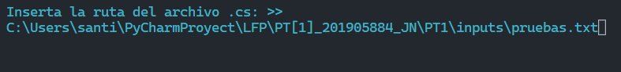

<link href='media/css/style.css' rel='stylesheet' type='text/css'></link>

# Manual de Usuario

 
 

Santiago Julián Barrera Reyes 
201905884 
Sección N 
Catedrático 
Ing. Kevin Adiel Lajpop Ajpacajá 
Tutor académico 
Pablo Fernando Cabrera Pineda 
“Id y enseñad a todos” 
 
 

## Índice   
1. [Introducción](#id1)
2. [Objetivos](#id2)
3. [Funcionalidad](#id3)
   1. [Menu](#id4)
   2. [Cargar Archivo](#id5)
   3. [Nombre Archivo](#id6)
   4. [Salir](#id7)

 
 

## Introducción
El analizador Lexico desarrollado por el estudiante en lenguaje python con las herramientas de renombre como Lex y Yacc tiene la finalidad de analizar el lenguaje Simple C o SC. El cual desarrollado con el propósito de crear una sintaxis simplificada con el fin de no utilizar el lenguaje de programacion c.

Ya que la empresa no requiere de un lenguaje funcional en esta fase unicamente solicita un analizador léxico capaz de reportar si un código fuente pertenece o no a dicho lenguaje y los tokens que el analizador léxico fue capaz de reconocer.

 

## Objetivos
- Creación de la Gramática:
  - Alfabeto del lenguaje
    - Símbolos terminales
    - Símbolos no terminales
  - Sintaxis del lenguaje
    - Precedencia de operadores
    - Producciones
- Desarrollar una aplicación de línea de comandos en Python. Al ejecutar la aplicación esta solicitará los siguientes parámetros:
    - Archivo del código fuente (.sc) 
    - Nombre de archivo de reporte (.html)
- Que el lenguaje sea case insensitive.
- Declarar y asignar variables.
- Identificar simbolos de operaciones aritméticas, lógicas y relacionales.
- Identificar simbolos de Estructuras condicionales.
- Identificar simbolos creación de funciones y métodos con y sin parámetros.
- Identificar simbolos creación retorno de funciones y métodos.
- Identificar simbolos llamado de funciones y métodos.

 

## Funcionalidad

### Menu
El menu cuenta con dos opciones las cuales se muestran a continuacion, es la parta principal del prgrama.

 
 

### Cargar Archivo
La opción cargar archivo se encarga de redireccionarlo un segundo plano donde podra ingresar el link de la direccion del archivo .sc el cual procedera a analaizar.

 
 

Al cargar este link se generar un mensaje el cual le indica que se a cargado el archivo con exito, si falla le sera posible visulizar la alerta de cual fue el error.

 
 

### Nombre Archivo
Esta opcion le permite nombrar el archivo html generado por el programado sin la necidad de escribir .html en el. Solo necesita del nombre para generar dicho archivo.

Al escribir el nombre, proceda a presionar la tecla ENTER para que el programa puede generar de forma automatica el archivo y pueda visualizarlo en su navegador por defecto.

El HTML generado le mostrara tres tablas:
- Tabla de Tokens
- Tabla de Errores
- Arbol Sintactico

**NOTA: Si no a procesado ningun archivo sera posible visulizar la alerta de cual fue el error la cual le indica que debe procesar antes el archivo .sc .**

 
 

 
 

 
 

 
 

### Salir
Esta opcion procede a cerrar el programa.